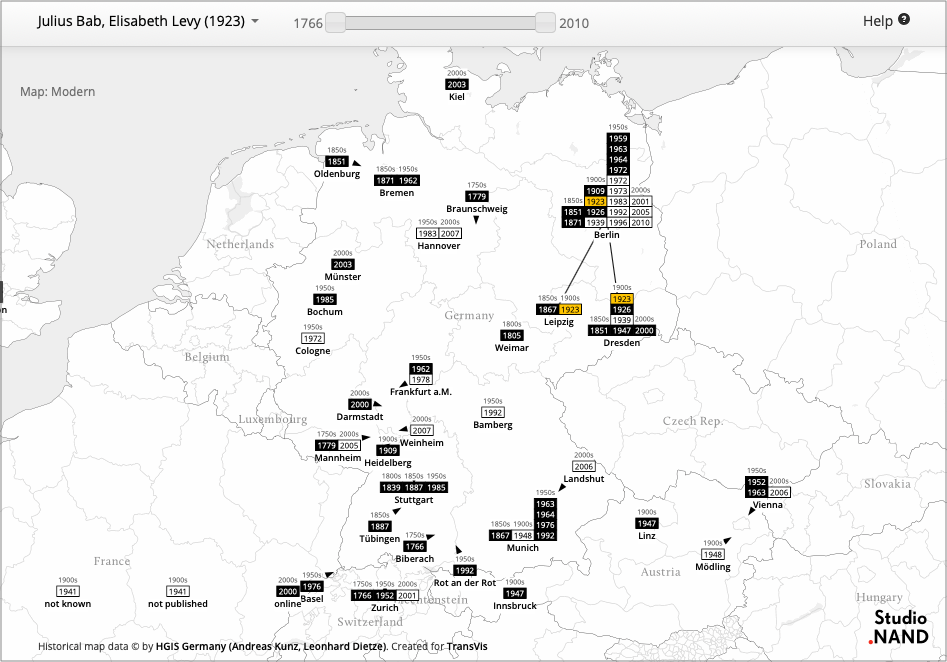

# Othello Map

## Overview

The Othello Map collects the places and people involved in German translations and adaptations of Shakespeare’s Othello between 1766 and 2010. The data was manually collected by [Tom Cheesman](https://en.wikipedia.org/wiki/Tom_Cheesman) at Swansea University and Stephan Thiel at [Studio NAND](https://nand.io) in 2013.

The interactive version is available online at [othellomap.nand.io](https://othellomap.nand.io).

## Technical Overview

This repository comes with a Docker configuration that includes everything to run the project locally or on a webserver. The basic requirements are Apache and PHP with support for SQLite to serve map tiles from Mapbox’s old `.mbtiles` format.

1. Install [Docker Desktop](https://www.docker.com/products/docker-desktop) for your system (current version `2.0.0.2`)
2. `cd path-to-this-repository` to switch to this repository.
3. `docker build -t othellomap .` to build the Docker image.
4. `docker run --name othellomap -p 8000:80 othellomap` to run a container based on the image we have just built.

If you want to make changes to the code while the container is running you will need to mount the local `html` subdirectory into the running container: `docker run --name othellomap  -p 8000:80 -v absolute-path-to-repo/html:/var/www/html othellomap`. You may then make changes to the code and reload the webpage to see them.

## Historical Map Layers

The project includes historical map layers from the [HGIS Project](http://www.hgis-germany.de). The layers in this repository have been created using the software [Tilemill](https://tilemill-project.github.io/tilemill/) from Mapbox, which is outdated. The `.mbtiles` generated with Tilemill are served as map layers using [Tileserver PHP](https://github.com/klokantech/tileserver-php/). Please note that usage of the map data and tile server may be subject to separate license agreements.

## Data

The data underlying these maps are located in `html/data` as CSV and XLS files.

### License

The Othello Map is [GPL licensed](./LICENSE).